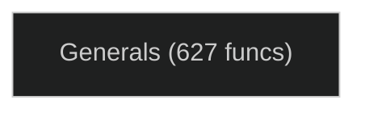

# Call Graph & Dependency Diagrams

Auto-generated from per-file architecture docs.

## Function Call Graph

Showing functions with 2+ incoming calls. Limited to 150 edges.

```mermaid
%%{ init: { 'theme': 'dark', 'flowchart': { 'curve': 'basis' } } }%%
graph LR

  subgraph Generals
    addCommonCommands["addCommonCommands"]
    addImageEntry["addImageEntry"]
    adjustDisplay["adjustDisplay"]
    Anim2D__draw["Anim2D::draw"]
    Anim2D__tryNextFrame["Anim2D::tryNextFrame"]
    ButtonFlashTransition__draw["ButtonFlashTransition::draw"]
    CanSelectDrawable["CanSelectDrawable"]
    clientUpdate["clientUpdate"]
    closeDownloadWindow["closeDownloadWindow"]
    computeTotalHeight["computeTotalHeight"]
    ControlBar__populateObserverInfoWindow["ControlBar::populateObserverInfoWindow"]
    ControlBar__populateObserverList["ControlBar::populateObserverList"]
    ControlBarObserverSystem["ControlBarObserverSystem"]
    copyReplay["copyReplay"]
    CreateLANGameInfoWindow["CreateLANGameInfoWindow"]
    createParticleSystem["createParticleSystem"]
    CreditsManager__addText["CreditsManager::addText"]
    CreditsManager__parseText["CreditsManager::parseText"]
    CreditsMenuInit["CreditsMenuInit"]
    CreditsMenuShutdown["CreditsMenuShutdown"]
    deleteRayEffect["deleteRayEffect"]
    deleteReplay["deleteReplay"]
    DestroyGameInfoWindow["DestroyGameInfoWindow"]
    destroyQuitMenu["destroyQuitMenu"]
    DiplomacySystem["DiplomacySystem"]
    doAttackMoveCommand["doAttackMoveCommand"]
    doAudioFeedback["doAudioFeedback"]
    doFireWeaponCommand["doFireWeaponCommand"]
    doGuardCommand["doGuardCommand"]
    doKeyUp_doKeyDown["doKeyUp/doKeyDown"]
    doLoadGame["doLoadGame"]
    doRadioUnselect["doRadioUnselect"]
    DownloadMenuInit["DownloadMenuInit"]
    DownloadMenuInput["DownloadMenuInput"]
    DownloadMenuSystem["DownloadMenuSystem"]
    DownloadMenuUpdate["DownloadMenuUpdate"]
    drawableIconNameToIndex["drawableIconNameToIndex"]
    drawTypeText["drawTypeText"]
    enableControls["enableControls"]
    errorCallback["errorCallback"]
    EstablishConnectionsControlSystem["EstablishConnectionsControlSystem"]
    Eva__playMessage__["Eva::playMessage()"]
    Eva__update__["Eva::update()"]
    ExMessageBoxYesNo__ExMessageBoxYesNoCancel__ExMessageBoxOkCancel__ExMessageBoxOk__ExMessageBoxCancel["ExMessageBoxYesNo, ExMessageBoxYesNoCancel, ExMessageBoxOkCancel, ExMessageBoxOk, ExMessageBoxCancel"]
    ExtendedMessageBoxSystem["ExtendedMessageBoxSystem"]
    fillCommandListBox["fillCommandListBox"]
    filterLine["filterLine"]
    findEntry["findEntry"]
    FlashTransition__update["FlashTransition::update"]
    FontLibrary__deleteAllFonts["FontLibrary::deleteAllFonts"]
    FontLibrary__getFont["FontLibrary::getFont"]
    FontLibrary__unlinkFont["FontLibrary::unlinkFont"]
    FullFadeTransition__draw["FullFadeTransition::draw"]
    GadgetHorizontalSliderInput["GadgetHorizontalSliderInput"]
    GadgetHorizontalSliderSystem["GadgetHorizontalSliderSystem"]
    GadgetListBoxInput["GadgetListBoxInput"]
    GadgetListBoxMultiInput["GadgetListBoxMultiInput"]
    GadgetListBoxSetListLength["GadgetListBoxSetListLength"]
    GadgetProgressBarSystem["GadgetProgressBarSystem"]
    GadgetRadioButtonInput["GadgetRadioButtonInput"]
    GadgetRadioButtonSystem["GadgetRadioButtonSystem"]
    GadgetRadioSetSelection["GadgetRadioSetSelection"]
    GadgetStaticTextSetText["GadgetStaticTextSetText"]
    GadgetTextEntryGetText["GadgetTextEntryGetText"]
    GameInfoWindowInit["GameInfoWindowInit"]
    GameSpyPlayerInfoOverlaySystem["GameSpyPlayerInfoOverlaySystem"]
    getCommandAvailability["getCommandAvailability"]
    getListboxEntryBasedOnCoord["getListboxEntryBasedOnCoord"]
    getMapPreviewImage["getMapPreviewImage"]
    getRayEffectData["getRayEffectData"]
    GlobalLanguage__adjustFontSize["GlobalLanguage::adjustFontSize"]
    GlobalLanguage__init["GlobalLanguage::init"]
    gogoExMessageBox["gogoExMessageBox"]
    handleInGameSlashCommands["handleInGameSlashCommands"]
    HandleNumPlayersOnline["HandleNumPlayersOnline"]
    HandleOverallStats["HandleOverallStats"]
    HandlePersistentStorageResponses["HandlePersistentStorageResponses"]
    handleStartPositionSelection["handleStartPositionSelection"]
    HeaderTemplateManager__init["HeaderTemplateManager::init"]
    hideBeacon["hideBeacon"]
    HideEstablishConnectionsWindow["HideEstablishConnectionsWindow"]
    HideGameInfoWindow["HideGameInfoWindow"]
    ImageCollection__load["ImageCollection::load"]
    InGameChatSystem["InGameChatSystem"]
    init["init"]
    initAnimateWindow["initAnimateWindow"]
    joinGame["joinGame"]
    KeyboardOptionsMenuInit["KeyboardOptionsMenuInit"]
    KeyboardOptionsMenuInput["KeyboardOptionsMenuInput"]
    KeyboardOptionsMenuSystem["KeyboardOptionsMenuSystem"]
    KeyboardTextEntryInput["KeyboardTextEntryInput"]
    LanLobbyMenuUpdate["LanLobbyMenuUpdate"]
    LanMapSelectMenuInit["LanMapSelectMenuInit"]
    LanMapSelectMenuSystem["LanMapSelectMenuSystem"]
    loadPostProcess["loadPostProcess"]
    mapListTooltipFunc["mapListTooltipFunc"]
    MessageBoxYesNo["MessageBoxYesNo"]
    MuLaw["MuLaw"]
    NormalizeToRange["NormalizeToRange"]
    NullifyControls["NullifyControls"]
    parseImageStatus["parseImageStatus"]
    parseMetaMap["parseMetaMap"]
    PassMessagesToParentSystem["PassMessagesToParentSystem"]
    PassSelectedButtonsToParentSystem["PassSelectedButtonsToParentSystem"]
    pickAndPlayUnitVoiceResponse["pickAndPlayUnitVoiceResponse"]
    populateBeacon["populateBeacon"]
    populateButtonProc["populateButtonProc"]
    populateCategoryBox["populateCategoryBox"]
    PopulateInGameDiplomacyPopup["PopulateInGameDiplomacyPopup"]
    populateMapListboxNoReset["populateMapListboxNoReset"]
    populateMultiSelect["populateMultiSelect"]
    populateOCLTimer["populateOCLTimer"]
    PopulatePlayerInfoWindows["PopulatePlayerInfoWindows"]
    populatePurchaseScience["populatePurchaseScience"]
    PopulateReplayFileListbox["PopulateReplayFileListbox"]
    populateSpecialPowerShortcut["populateSpecialPowerShortcut"]
    populateStructureInventory["populateStructureInventory"]
    PopupJoinGameInit["PopupJoinGameInit"]
    PopupJoinGameInput["PopupJoinGameInput"]
    PopupJoinGameSystem["PopupJoinGameSystem"]
    PopupLadderSelectInit["PopupLadderSelectInit"]
    PopupLadderSelectInput["PopupLadderSelectInput"]
    PopupLadderSelectSystem["PopupLadderSelectSystem"]
    PopupReplayInit["PopupReplayInit"]
    PopupReplaySystem["PopupReplaySystem"]
    positionStartSpots["positionStartSpots"]
    PrintInfoRecursive["PrintInfoRecursive"]
    PrintOffsetsFromControlBarParent["PrintOffsetsFromControlBarParent"]
    processCommandTransitionUI["processCommandTransitionUI"]
    processCommandUI["processCommandUI"]
    processMouseEvent["processMouseEvent"]
    PushButtonImageDrawThree["PushButtonImageDrawThree"]
    QuitMenuSystem["QuitMenuSystem"]
    reallySaveReplay["reallySaveReplay"]
    RefreshGameInfoWindow["RefreshGameInfoWindow"]
    ReplayMenuSystem["ReplayMenuSystem"]
    resetCommonCommandData["resetCommonCommandData"]
    reverseAnimateWindow["reverseAnimateWindow"]
    SaveLoadMenuFullScreenInit["SaveLoadMenuFullScreenInit"]
    SaveLoadMenuInit["SaveLoadMenuInit"]
    SaveLoadMenuSystem["SaveLoadMenuSystem"]
    saveReplay["saveReplay"]
    selectFriends["selectFriends"]
    SetDifficultyRadioButton["SetDifficultyRadioButton"]
    setKeyDown["setKeyDown"]
    setPasswordMode["setPasswordMode"]
    shouldSaveDrawable["shouldSaveDrawable"]
    ShowDiplomacy["ShowDiplomacy"]
    ShowEstablishConnectionsWindow["ShowEstablishConnectionsWindow"]
    showGameSpyGameOptionsUnderlyingGUIElements["showGameSpyGameOptionsUnderlyingGUIElements"]
    showGameSpyQMUnderlyingGUIElements["showGameSpyQMUnderlyingGUIElements"]
    ShowInGameChat["ShowInGameChat"]
    shutdownComplete["shutdownComplete"]
    SinglePlayerMenuShutdown["SinglePlayerMenuShutdown"]
    SinglePlayerMenuUpdate["SinglePlayerMenuUpdate"]
    SkirmishMapSelectMenuInit["SkirmishMapSelectMenuInit"]
    SkirmishMapSelectMenuShutdown["SkirmishMapSelectMenuShutdown"]
    SkirmishMapSelectMenuSystem["SkirmishMapSelectMenuSystem"]
    successNoQuitCallback["successNoQuitCallback"]
    successQuitCallback["successQuitCallback"]
    ToggleInGameChat["ToggleInGameChat"]
    ToggleQuitMenu["ToggleQuitMenu"]
    translateGameMessage["translateGameMessage"]
    unHaxor["unHaxor"]
    unselectOtherRadioOfGroup["unselectOtherRadioOfGroup"]
    updateAnimateWindow["updateAnimateWindow"]
    updateContextMultiSelect["updateContextMultiSelect"]
    updateContextOCLTimer["updateContextOCLTimer"]
    updateContextStructureInventory["updateContextStructureInventory"]
    UpdateDiplomacyBriefingText["UpdateDiplomacyBriefingText"]
    updateLadderDetails["updateLadderDetails"]
    updateMenuActions["updateMenuActions"]
    updateMouseData["updateMouseData"]
    updateOCLTimerTextDisplay["updateOCLTimerTextDisplay"]
    updateServerDisplay["updateServerDisplay"]
    updateSpecialPowerShortcut["updateSpecialPowerShortcut"]
    updateSway["updateSway"]
    validUnderCursor["validUnderCursor"]
    WindowTranslator__translateGameMessage["WindowTranslator::translateGameMessage"]
    WindowVideoManager__playMovie["WindowVideoManager::playMovie"]
    WindowVideoManager__update["WindowVideoManager::update"]
    winPointInAnyChild["winPointInAnyChild"]
    WOLGameSetupMenuSystem["WOLGameSetupMenuSystem"]
    WOLWelcomeMenuInit["WOLWelcomeMenuInit"]
    WOLWelcomeMenuSystem["WOLWelcomeMenuSystem"]
    xfer["xfer"]
    xferDrawableTOC["xferDrawableTOC"]
  end

  clientUpdate --> getDrawable
  hideBeacon --> getDrawable
  hideBeacon --> createParticleSystem
  clientUpdate --> createParticleSystem
  loadPostProcess --> updateSway
  shouldSaveDrawable --> getObject
  xfer --> xferDrawableTOC
  populatePurchaseScience --> setControlCommand
  populateSpecialPowerShortcut --> setControlCommand
  updateSpecialPowerShortcut --> getCommandAvailability
  populateBeacon --> setPortraitByObject
  populateBeacon --> GadgetTextEntrySetText
  processCommandUI --> GadgetButtonGetData
  processCommandUI --> pickAndPlayUnitVoiceResponse
  resetCommonCommandData --> GadgetButtonDrawOverlayImage
  addCommonCommands --> setControlCommand
  populateMultiSelect --> resetCommonCommandData
  populateMultiSelect --> addCommonCommands
  populateMultiSelect --> setPortraitByObject
  updateContextMultiSelect --> getCommandAvailability
  ControlBarObserverSystem --> GadgetButtonGetData
  ControlBar__populateObserverList --> GadgetButtonSetEnabledImage
  ControlBar__populateObserverList --> GadgetStaticTextSetText
  ControlBar__populateObserverInfoWindow --> GadgetStaticTextSetText
  updateOCLTimerTextDisplay --> GadgetStaticTextSetText
  populateOCLTimer --> findCommandButton
  populateOCLTimer --> setControlCommand
  populateOCLTimer --> updateContextOCLTimer
  populateOCLTimer --> setPortraitByObject
  updateContextOCLTimer --> getObject
  updateContextOCLTimer --> updateOCLTimerTextDisplay
  PrintInfoRecursive --> winGetSize
  PrintInfoRecursive --> winGetPosition
  PrintInfoRecursive --> winGetInstanceData
  PrintInfoRecursive --> winGetChild
  PrintOffsetsFromControlBarParent --> winGetWindowFromId
  PrintOffsetsFromControlBarParent --> nameToKey
  PrintOffsetsFromControlBarParent --> winCreateLayout
  PrintOffsetsFromControlBarParent --> PrintInfoRecursive
  PrintOffsetsFromControlBarParent --> destroyWindows
  PrintOffsetsFromControlBarParent --> deleteInstance
  populateButtonProc --> GadgetButtonSetEnabledImage
  populateButtonProc --> GadgetButtonDrawOverlayImage
  populateStructureInventory --> findCommandButton
  populateStructureInventory --> setControlCommand
  updateContextStructureInventory --> populateStructureInventory
  GadgetHorizontalSliderInput --> winGetUserData
  GadgetHorizontalSliderInput --> winGetInstanceData
  GadgetHorizontalSliderInput --> winGetSize
  GadgetHorizontalSliderInput --> winGetChild
  GadgetHorizontalSliderInput --> winSendSystemMsg
  GadgetHorizontalSliderInput --> winSetFocus
  GadgetHorizontalSliderInput --> winGetScreenPosition
  GadgetHorizontalSliderInput --> winSetPosition
  GadgetHorizontalSliderSystem --> winGetUserData
  GadgetHorizontalSliderSystem --> winGetInstanceData
  GadgetHorizontalSliderSystem --> winGetSize
  GadgetHorizontalSliderSystem --> winGetChild
  GadgetHorizontalSliderSystem --> winGetScreenPosition
  GadgetHorizontalSliderSystem --> winGetPosition
  GadgetHorizontalSliderSystem --> winSetPosition
  GadgetHorizontalSliderSystem --> winSendSystemMsg
  addImageEntry --> computeTotalHeight
  GadgetListBoxInput --> doAudioFeedback
  GadgetListBoxInput --> getListboxEntryBasedOnCoord
  GadgetListBoxInput --> adjustDisplay
  GadgetListBoxMultiInput --> doAudioFeedback
  GadgetListBoxMultiInput --> getListboxEntryBasedOnCoord
  GadgetListBoxMultiInput --> adjustDisplay
  GadgetListBoxSetListLength --> computeTotalHeight
  doRadioUnselect --> BitTest
  doRadioUnselect --> BitClear
  unselectOtherRadioOfGroup --> doRadioUnselect
  GadgetRadioButtonInput --> BitTest
  GadgetRadioButtonInput --> BitSet
  GadgetRadioButtonInput --> BitClear
  GadgetRadioButtonSystem --> BitTest
  GadgetRadioButtonSystem --> BitSet
  GadgetRadioButtonSystem --> BitClear
  GadgetRadioButtonSystem --> delete
  FontLibrary__unlinkFont --> DEBUG_CRASH
  FontLibrary__getFont --> DEBUG_CRASH
  PassSelectedButtonsToParentSystem --> winGetParent
  PassSelectedButtonsToParentSystem --> winSendSystemMsg
  PassMessagesToParentSystem --> winGetParent
  PassMessagesToParentSystem --> winSendSystemMsg
  FlashTransition__update --> winHide
  ButtonFlashTransition__draw --> winGetScreenPosition
  ButtonFlashTransition__draw --> winGetSize
  ButtonFlashTransition__draw --> GadgetButtonGetLeftEnabledImage
  PushButtonImageDrawThree --> winGetScreenPosition
  PushButtonImageDrawThree --> winGetSize
  PushButtonImageDrawThree --> GadgetButtonGetLeftEnabledImage
  drawTypeText --> winGetScreenPosition
  drawTypeText --> winGetSize
  ShowDiplomacy --> PopulateInGameDiplomacyPopup
  PopulateInGameDiplomacyPopup --> GadgetStaticTextSetText
  DiplomacySystem --> PopulateInGameDiplomacyPopup
  UpdateDiplomacyBriefingText --> GadgetListBoxReset
  UpdateDiplomacyBriefingText --> GadgetListBoxAddEntryText
  gogoExMessageBox --> GadgetStaticTextSetText
  gogoExMessageBox --> NEW
  ExtendedMessageBoxSystem --> delete
  ExMessageBoxYesNo__ExMessageBoxYesNoCancel__ExMessageBoxOkCancel__ExMessageBoxOk__ExMessageBoxCancel --> gogoExMessageBox
  ShowInGameChat --> winGetWindowFromId
  ShowInGameChat --> GadgetTextEntrySetText
  ShowInGameChat --> winSetFocus
  ToggleInGameChat --> GadgetTextEntryGetText
  ToggleInGameChat --> handleInGameSlashCommands
  InGameChatSystem --> ToggleInGameChat
  InGameChatSystem --> GadgetTextEntrySetText
  CreditsMenuInit --> delete
  CreditsMenuShutdown --> delete
  SetDifficultyRadioButton --> GadgetRadioSetSelection
  closeDownloadWindow --> destroyWindows
  closeDownloadWindow --> deleteInstance
  closeDownloadWindow --> winSetFocus
  errorCallback --> HandleCanceledDownload
  errorCallback --> closeDownloadWindow
  successQuitCallback --> closeDownloadWindow
  successNoQuitCallback --> HandleCanceledDownload
  successNoQuitCallback --> closeDownloadWindow
  DownloadMenuInit --> nameToKey
  DownloadMenuInit --> winGetWindowFromId
  DownloadMenuInit --> NEW
  DownloadMenuUpdate --> GadgetStaticTextSetText
  DownloadMenuInput --> winSendSystemMsg
  DownloadMenuSystem --> HandleCanceledDownload
  DownloadMenuSystem --> closeDownloadWindow
  showGameSpyGameOptionsUnderlyingGUIElements --> ShowUnderlyingGUIElements
  showGameSpyQMUnderlyingGUIElements --> ShowUnderlyingGUIElements
  ShowEstablishConnectionsWindow --> winCreateLayout
  ShowEstablishConnectionsWindow --> winSetFocus
  HideEstablishConnectionsWindow --> destroyWindows
  HideEstablishConnectionsWindow --> deleteInstance
  CreateLANGameInfoWindow --> winCreateLayout
  CreateLANGameInfoWindow --> winGetScreenPosition
  CreateLANGameInfoWindow --> winSetPosition
  CreateLANGameInfoWindow --> winGetSize
  DestroyGameInfoWindow --> destroyWindows
  DestroyGameInfoWindow --> deleteInstance
  RefreshGameInfoWindow --> winHide
  RefreshGameInfoWindow --> GadgetStaticTextSetText
  RefreshGameInfoWindow --> GadgetListBoxReset
  RefreshGameInfoWindow --> GadgetListBoxAddEntryText
  RefreshGameInfoWindow --> GadgetListBoxAddEntryImage
  HideGameInfoWindow --> winHide
  GameInfoWindowInit --> nameToKey
  GameInfoWindowInit --> winGetWindowFromId
  GameInfoWindowInit --> GadgetStaticTextSetText
```

## Subsystem Dependencies

Cross-subsystem call edges. Arrow labels show call counts.



## Statistics

- Total functions documented: 627
- Total call edges: 436
- Subsystems: 1

