# Call Graph & Dependency Diagrams

Auto-generated from per-file architecture docs.

## Function Call Graph

Showing functions with 2+ incoming calls. Limited to 150 edges.

```mermaid
%%{ init: { 'theme': 'dark', 'flowchart': { 'curve': 'basis' } } }%%
graph LR

  subgraph Generals
    addCommand["addCommand"]
    addMessage["addMessage"]
    allCommandsReady["allCommandsReady"]
    CommandRequiresAck["CommandRequiresAck"]
    CommandRequiresDirectSend["CommandRequiresDirectSend"]
    connectCallback["connectCallback"]
    createRoomCallback["createRoomCallback"]
    decryptBuf["decryptBuf"]
    DoesCommandRequireACommandID["DoesCommandRequireACommandID"]
    doRelay__["doRelay()"]
    doSend___doRecv["doSend / doRecv"]
    downloadNextQueuedFile["downloadNextQueuedFile"]
    encryptBuf["encryptBuf"]
    findMessage["findMessage"]
    GameResultsThreadClass__sendGameResults["GameResultsThreadClass::sendGameResults"]
    GameSpyAddText["GameSpyAddText"]
    GameSpyChat__login["GameSpyChat::login"]
    GameSpyChat__startGame["GameSpyChat::startGame"]
    GameSpyInfo__addChat["GameSpyInfo::addChat"]
    GameSpyInfo__addText["GameSpyInfo::addText"]
    GameSpyInfo__sendChat["GameSpyInfo::sendChat"]
    GameSpyInfo__setGameOptions["GameSpyInfo::setGameOptions"]
    gameSpyInitPersistentStorageConnection["gameSpyInitPersistentStorageConnection"]
    GameSpyOpenOverlay["GameSpyOpenOverlay"]
    GameSpySendChat["GameSpySendChat"]
    GetAsciiNetCommandType["GetAsciiNetCommandType"]
    GetLocalChatConnectionAddress["GetLocalChatConnectionAddress"]
    getPersistentDataCallback["getPersistentDataCallback"]
    GPErrorCallback["GPErrorCallback"]
    GPRecvBuddyMessageCallback["GPRecvBuddyMessageCallback"]
    GPRecvBuddyRequestCallback["GPRecvBuddyRequestCallback"]
    GPRecvBuddyStatusCallback["GPRecvBuddyStatusCallback"]
    grabHexInt["grabHexInt"]
    GSMessageBoxOk["GSMessageBoxOk"]
    GSMessageBoxOkCancel["GSMessageBoxOkCancel"]
    handleChat["handleChat"]
    handleGameStart["handleGameStart"]
    handleInActive["handleInActive"]
    handleJoinAccept["handleJoinAccept"]
    handleRequestJoin["handleRequestJoin"]
    handleSlashCommands["handleSlashCommands"]
    handleUnicodeMessage["handleUnicodeMessage"]
    IPEnumeration__getAddresses["IPEnumeration::getAddresses"]
    IPEnumeration__getMachineName["IPEnumeration::getMachineName"]
    isEqualCommandMsg["isEqualCommandMsg"]
    LadderList__loadLocalLadders["LadderList::loadLocalLadders"]
    listingGamesCallback["listingGamesCallback"]
    MultiByteToWideCharSingleLine["MultiByteToWideCharSingleLine"]
    NetCommandWrapperList__getReadyCommands["NetCommandWrapperList::getReadyCommands"]
    NetCommandWrapperList__processWrapper["NetCommandWrapperList::processWrapper"]
    NetCommandWrapperList__removeFromList["NetCommandWrapperList::removeFromList"]
    NetCommandWrapperListNode__copyChunkData["NetCommandWrapperListNode::copyChunkData"]
    notifyOthersOfCurrentFrame__["notifyOthersOfCurrentFrame()"]
    OnAccept["OnAccept"]
    OnChat["OnChat"]
    OnGameStart["OnGameStart"]
    OnPlayerJoin["OnPlayerJoin"]
    parseLadder["parseLadder"]
    PlayerJoinedCallback["PlayerJoinedCallback"]
    PlayerMessageCallback["PlayerMessageCallback"]
    processCommand_GameMessage_msg_["processCommand(GameMessage msg)"]
    processDisconnectCommand["processDisconnectCommand"]
    queueFileForDownload["queueFileForDownload"]
    queueSend["queueSend"]
    ResolveIP["ResolveIP"]
    roomKeyChangedCallback["roomKeyChangedCallback"]
    RoomMessageCallback["RoomMessageCallback"]
    sendChat__["sendChat()"]
    sendFileAnnounce__["sendFileAnnounce()"]
    SetUpGameSpy["SetUpGameSpy"]
    TearDownGameSpy["TearDownGameSpy"]
    update["update"]
    update__["update()"]
    updateLoadProgress__["updateLoadProgress()"]
    voteForPlayerDisconnect["voteForPlayerDisconnect"]
    WideCharStringToMultiByte["WideCharStringToMultiByte"]
  end

  sendChat__ --> sendLocalCommand
  sendFileAnnounce__ --> sendLocalCommand
  updateLoadProgress__ --> sendLocalCommand
  notifyOthersOfCurrentFrame__ --> processDisconnectCommand
  allCommandsReady --> DEBUG_LOG
  GameSpyInfo__sendChat --> GadgetListBoxGetSelected
  GameSpyInfo__sendChat --> GadgetListBoxGetText
  GameSpyInfo__addChat --> GadgetListBoxSetItemData
  GameSpyInfo__addText --> GadgetListBoxAddEntryText
  GameSpyInfo__addText --> GadgetListBoxSetItemData
  parseLadder --> NEW
  parseLadder --> MultiByteToWideCharSingleLine
  SetUpGameSpy --> TearDownGameSpy
  playerJoinedCallback --> getPlayerInfo
  roomKeyChangedCallback --> getPlayerInfo
  MultiByteToWideCharSingleLine --> NEW
  MultiByteToWideCharSingleLine --> wcslen
  WideCharStringToMultiByte --> NEW
  WideCharStringToMultiByte --> wcslen
  GameSpySendChat --> handleSlashCommands
  GameSpySendChat --> GadgetListBoxGetSelected
  GameSpySendChat --> GadgetListBoxGetText
  RoomMessageCallback --> handleUnicodeMessage
  RoomMessageCallback --> QuotedPrintableToUnicodeString
  PlayerMessageCallback --> handleUnicodeMessage
  PlayerMessageCallback --> QuotedPrintableToUnicodeString
  handleUnicodeMessage --> GameSpyAddText
  GameSpyAddText --> GadgetListBoxAddEntryText
  GetLocalChatConnectionAddress --> gethostbyname
  GPRecvBuddyMessageCallback --> DEBUG_LOG
  GPErrorCallback --> DEBUG_LOG
  GPRecvBuddyStatusCallback --> DEBUG_LOG
  GPRecvBuddyRequestCallback --> DEBUG_LOG
  GameSpyOpenOverlay --> ClearGSMessageBoxes
  GameSpyOpenOverlay --> MessageBoxOk
  GameSpyOpenOverlay --> MessageBoxOkCancel
  GSMessageBoxOk --> ClearGSMessageBoxes
  GSMessageBoxOk --> MessageBoxOk
  GSMessageBoxOkCancel --> ClearGSMessageBoxes
  GSMessageBoxOkCancel --> MessageBoxOkCancel
  IPEnumeration__getAddresses --> WSAStartup
  IPEnumeration__getAddresses --> gethostname
  IPEnumeration__getAddresses --> gethostbyname
  IPEnumeration__getAddresses --> newInstance
  IPEnumeration__getAddresses --> DEBUG_LOG
  IPEnumeration__getMachineName --> WSAStartup
  IPEnumeration__getMachineName --> gethostname
  IPEnumeration__getMachineName --> DEBUG_LOG
  OnAccept --> RequestGameOptions
  OnAccept --> lanUpdateSlotList
  OnChat --> GadgetListBoxAddEntryText
  OnPlayerJoin --> RequestGameOptions
  OnPlayerJoin --> lanUpdateSlotList
  handleRequestJoin --> LookupGame
  handleRequestJoin --> OnPlayerJoin
  handleRequestJoin --> OnGameJoin
  handleJoinAccept --> LookupGame
  handleJoinAccept --> OnGameJoin
  handleChat --> OnChat
  handleGameStart --> OnGameStart
  handleInActive --> RequestGameOptions
  handleInActive --> lanUpdateSlotList
  addMessage --> isEqualCommandMsg
  addMessage --> DoesCommandRequireACommandID
  findMessage --> isEqualCommandMsg
  findMessage --> DoesCommandRequireACommandID
  isEqualCommandMsg --> DoesCommandRequireACommandID
  NetCommandWrapperList__processWrapper --> newInstance
  NetCommandWrapperList__getReadyCommands --> newInstance
  ResolveIP --> gethostbyname
  CommandRequiresAck --> getNetCommandType
  CommandRequiresDirectSend --> getNetCommandType
  encryptBuf --> htonl
  decryptBuf --> htonl
  queueSend --> encryptBuf
  doSend___doRecv --> encryptBuf
  doSend___doRecv --> decryptBuf
```

## Subsystem Dependencies

Cross-subsystem call edges. Arrow labels show call counts.

## Statistics

- Total functions documented: 217
- Total call edges: 168
- Subsystems: 1

